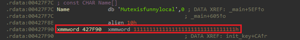
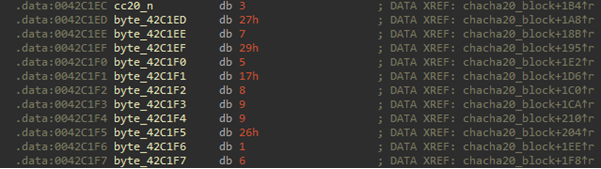
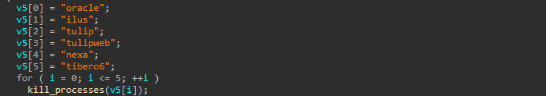
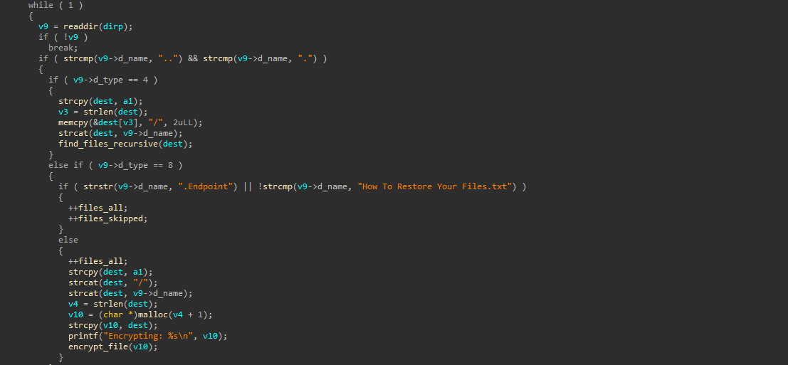
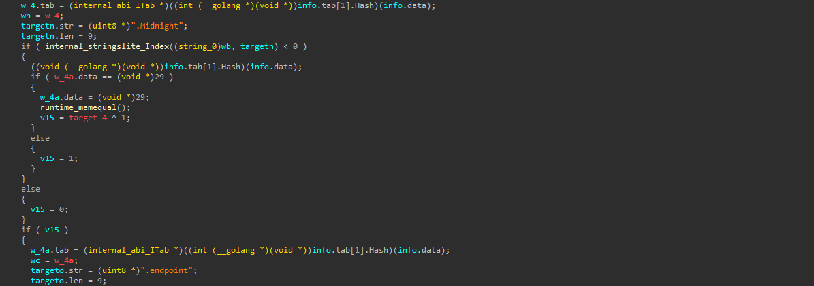
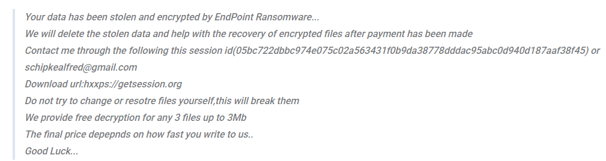

# INTRODUCTION

**EndPoint Ransomware** is a variant of the ransomware previously known as *Midnight*, and it is built on the **Babuk** framework.
This ransomware has been observed in versions capable of encrypting environments beyond **Windows**, including **ESXi** and **NAS**.

The actors steal sensitive data and then encrypt files, using **decryption and data leakage as leverage to demand money**.
However, due to mistakes made during the encryption process, **Avast released a decryption tool in October 2025**.
<br/><br/>

---

# WINDOWS VERSION ANALYSIS

> *Because this ransomware is based on Babuk, a detailed analysis will not be provided.*

* **Encryption scheme**

  * File contents are encrypted using **ChaCha20**.
  * The ChaCha20 **Key** and **Nonce** are derived by encrypting with **curve25519** and then hashing the result with **SHA-256**; the hash output is used as the Key and Nonce.
  * To speed up encryption, files are categorized as **LARGE / MEDIUM / SMALL**, and **only partial portions of the data** are encrypted.

* **Implementation mistake**

  * The original design should have generated random values to produce different public keys per file (or per session), but due to an error they encrypted all files using a **hardcoded identical key**.
    This mistake made decryption possible and allowed Avast to publish a decryption tool.

* **Files and ransom note**

  * Encrypted files have the **`.Endpoint`** extension appended.
  * The attackers create a **ransom note** that contains contact information for extortion.


<p align="center">
  <br/>
  <em>Figure 1. Hardcoded ChaCha20 Key</em>
</p>


<p align="center">
  <br/>
  <em>Figure 1. Hardcoded ChaCha20 Nonce</em>
</p>

## RansomNote
```
Your data has been stolen and encrypted by EndPoint Ransomware...We will delete the stolen data and help with the recovery of encrypted files after payment has been madeContact me through the following this utox id(6615A0B77B74C26F6E5469B71326F0658783B6FF998B0DC67006C7137E8BC14D4C0784E5FE19)Do not try to change or resotre files yourself,this will break themWe provide free decryption for any 3 files up to 3MbThe final price depepnds on how fast you write to us..Good Luck...
```

## PoC
```Go
package main
import (
	"fmt"
	"os"
	"golang.org/x/crypto/chacha20"
)
func decrypt_file(path string) {
	file, err := os.OpenFile(path, os.O_RDWR, 0)
	if err != nil {
		fmt.Println(err)
		return
	}
	defer file.Close()

	fi, err := file.Stat()
	if err != nil {
		fmt.Println(err)
		return
	}

	var offset int64 = 0
	var file_size = fi.Size()
	if file_size > 38 {
		var cc20_k = [32]byte{0x11, 0x11, 0x11, 0x11, 0x11, 0x11, 0x11, 0x11, 0x11, 0x11, 0x11, 0x11, 0x11, 0x11, 0x11, 0x11, 0x11, 0x11, 0x11, 0x11, 0x11, 0x11, 0x11, 0x11, 0x11, 0x11, 0x11, 0x11, 0x11, 0x11, 0x11, 0x11}
		var cc20_n = [12]byte{0x03, 0x27, 0x07, 0x29, 0x05, 0x17, 0x08, 0x09, 0x09, 0x26, 0x01, 0x06}
		stream, err := chacha20.NewUnauthenticatedCipher(cc20_k[:], cc20_n[:])
		if err != nil {
			fmt.Println(err)
			return
		}
		stream.SetCounter(20) // Windows

		file_size -= 0x638 // Org Size
		if file_size > 0x6400000 {
			fmt.Println("Large Cipher MODE")
		} else {
			fmt.Println("Small Cipher MODE")
			var size_to_encrypt int64 = 0
			if file_size <= 0x3000 {
				size_to_encrypt = file_size / 3
			} else {
				size_to_encrypt = 0x3000
			}

			fmt.Printf("size_to_encrypt : ", size_to_encrypt)
			var buffer = make([]byte, size_to_encrypt)
			r, _ := file.ReadAt(buffer, offset)
			if int64(r) != size_to_encrypt {
				fmt.Printf("ERROR: %d != %d\n", r, size_to_encrypt)
				return
			}
			stream.XORKeyStream(buffer, buffer)
			file.WriteAt(buffer, offset)
			file.Truncate(file_size)
		}
		
	}
}


func main() {
	decrypt_file("TEST.TEXT.endpoint")
}

```

---


# LINUX VERSION ANALYSIS

* **Decryption is not possible using the same method as the Windows version**
* **Differences from the original Babuk**

  * Terminates six specific processes before starting the encryption routine.
  * Although it is based on Babuk’s ESXi version, it encrypts all regular files instead of limiting encryption to ESXi-related files such as ".log" or ".vmdk".
  * Divides data into block sizes of **2MB**, **5MB**, and **10MB** for encryption.
  * Does **not** utilize a thread pool.


 
<p align="center">
  <br/>
  <em>Figure 3. Kill Process</em>
</p>

<p align="center">
  <br/>
  <em>Figure 4. find_files_recursive</em>
</p>


---

# Suspicious Points
* **Midnight or EndPoint Ransomware developed in Go?**

  * During the investigation, we discovered a ransomware sample written in the **Go language**, which contained code handling two extensions: **`.Midnight`** and **`.endpoint`**.
    This suggests that the two ransomware groups may be **affiliated or operated by the same organization**.

<p align="center">
  <br/>
  <em>Figure 5. Midnight and endpoint extension</em>
</p>

---

* **Email address used in previous ransom notes**

  * In earlier ransom notes, a combination of a *getSession ID* and a Gmail address was found.
  * The discovered email address is **[schipkealfred@gmail.com](mailto:schipkealfred@gmail.com)**, which appears to impersonate **Alfred Schipke**, the Director and Professor at the East Asian Institute.
  * This Gmail account has been identified as one **used by DPRK hackers since 2024**.

<p align="center">
  <br/>
  <em>Figure 6. Old RansomNote</em>
</p>

---

* **Are the targets Korean companies?**

  * In the Linux version of the ransomware, before encryption begins, it terminates processes named `oracle`, `ilus`, `tulip`, `tulipweb`, `nexa`, and `tibero6`.
  * These processes are mostly associated with **Korean enterprise software solutions**, suggesting that **Korean companies were the intended targets**.
  * In my personal opinion, considering the impersonation of the East Asian Institute Director and the process names related to Korean software, it is **highly probable that DPRK-affiliated hackers** are behind this attack.


  
--- 
# IOC
* schipkealfred@gmail.com
* B77AD606BA04D2D0077130679A257C96
* 34BE5E70F1260DA87096B80DC7B026AC
* E82BCF417F51ACC6B2D8A94CEABD5E36
* C00CC937E064946EE42776CFE80754D7
* 27E1B7E2D64059612FBF8F3068BCC391
* 06D6A40936D9F89E02B839D038E23F38

# reference

* https://github.com/Hildaboo/BabukRansomwareSourceCode
* https://www.gendigital.com/blog/insights/research/midnight-ransomware
* https://www.pcrisk.com/removal-guides/32385-endpoint-ransomware

